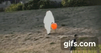
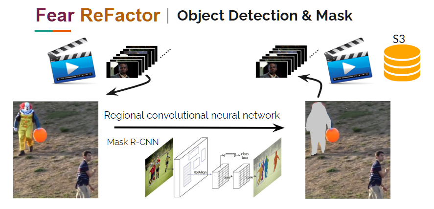
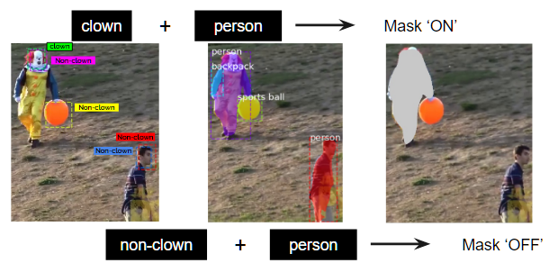

# What is Fear ReFactor?
Fear ReFactor is a web app that masks phobia objects on YouTube videos. Currently, the specific objects, 'clown', 'dog', 'bird', and 'teddy bear' are available.
Notice that Fear ReFactor requires GPU to run properly. If you prefer to run this streamlit app on your local computer, use [this code](https://github.com/HannahhoHe/Fear-ReFactor-Mask-R-CNN-Transfer-Learning/blob/master/FearReFactor_streamlit_pub.py) and don't forget to type in your email login credentials (line 526 and line 535). Otherwise, this streamlit web app is available [here](https://52.34.156.240:8501), deployed on Amazon EC2 (p2 instance). Please email me at Dr.HeHannah@gmail.com if the port is not open.   

This repo focuses on building a model to detect and mask ALL 'clown' objects throughout a YouTube video. To achieve this, I performed transfer learning with [matterport/Mask_RCNN](https://github.com/matterport/Mask_RCNN). Below is a post-masked clown video from [YouTube](https://www.youtube.com/watch?v=GGOMD2DlJUY&t=107s).  

  

# Fear ReFactor Workflow
Fear ReFactor takes every frame from the video, running through the Mask R-CNN models built in this repo, and re-constructs all the processed frames to a video, stored in Amazon S3 bucket. Every processed video should have the clown object completely masked. [This code](https://github.com/HannahhoHe/Fear-ReFactor-Mask-R-CNN-Transfer-Learning/blob/master/vid-im.ipynb) includes the process of parsing video and audio frames, and constructing and playing a video.    

  

# Building up Mask R-CNN models 
To prepare 1000+ training images, I scraped both Google static images and YouTube video images. [This code](https://github.com/HannahhoHe/Fear-ReFactor-Mask-R-CNN-Transfer-Learning/blob/master/google-im.ipynb) shows you how to use Google Selenium and headless Chrome to scrape large amounts of image data in AWS/EC2 [The original code was shared by [Fabian Bosler](https://towardsdatascience.com/image-scraping-with-python-a96feda8af2d)]. Image annotation was performed by [LabelImg](https://github.com/tzutalin/labelImg) and by which XML files in PASCAL VOC format were generated.

Since clown is a complicated object which shares the same feature as a person as well as non-human but colorful objects, to achieve a clown instance segmentation in pixel level, we can expect huge amounts of training images will be required. To minimize the training process but still get a good clown-centered mask, I decided to implement two Mask R-CNN models - one with transfer learning to train a 'clown face' vs 'non-clown objects', and one with the pre-trained COCO model - to maximize the use of MS COCO mask. The transfer-learning code is available [here](https://github.com/HannahhoHe/Fear-ReFactor-Mask-R-CNN-Transfer-Learning/blob/master/train.ipynb), and after training, [this code](https://github.com/HannahhoHe/Fear-ReFactor-Mask-R-CNN-Transfer-Learning/blob/master/test.ipynb) can test different epoch models and generate batch images to visualize where the bounding box are. [Statistical analysis](https://github.com/HannahhoHe/Fear-ReFactor-Mask-R-CNN-Transfer-Learning/blob/master/ana-1.ipynb) and [more plotting](https://github.com/HannahhoHe/Fear-ReFactor-Mask-R-CNN-Transfer-Learning/blob/master/ana-2.ipynb) show that a ~100% recall rate is possible by lowering the detection minimum confince.  

  

